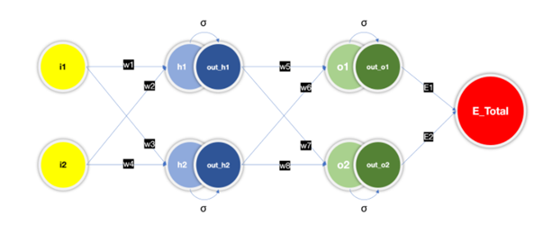
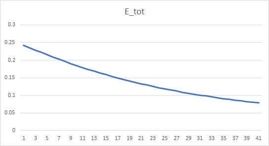

**Part 1** 
  
**Rewrite the whole excel sheet showing backpropagation. Explain each major step, and write it on Github.**  
  

Screenshot of Excel sheet   
  
  
The neural network considered is as shown below,  

Let us assume initial values as follows   

  
List of formulae:  
  

  

  
  
  
Applying formulae on initial values, we fill up the excel sheet.   
  
By changing the learning rate, the following graphs are obtained.   
   
Learning rate = 0.2  
  
Learning rate = 0.5  
  
Learning rate = 0.8  
  
Learning rate = 1  
  
Learning rate = 2  
  

  
  
